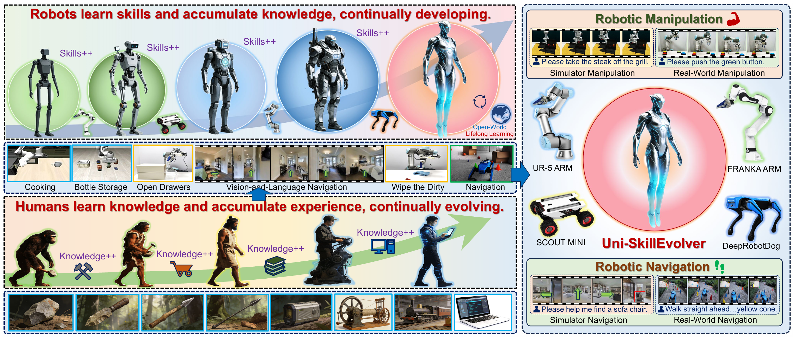

# Uni-SkillEvolver: Lifelong Robotic Skills Learning

<div id="top" align="center">
<p align="center">

</p>
</div>

Recent large-scale vision-language models have significantly advanced robotic skill learning, promoting progress in both vision-and-language navigation and vision-language-action manipulation. However, existing robotic agents are typically trained under static multi-task settings, which limits their ability to continually acquire new skills in dynamic open-world environments without catastrophically forgetting previously learned ones. To address this limitation, we formulate a new problem, termed Lifelong Robotic Skills Learning (LRSL), where an embodied agent is required to continually learn a sequence of navigation and manipulation skills across different robotic embodiments, while preserving prior knowledge and performing task-agnostic inference without access to task identities. To solve LRSL, we propose Uni-SkillEvolver, a unified lifelong robotic agent that explicitly decomposes robotic skill knowledge into skill-shared and skill-specific components. Specifically, we design an Orthogonal Decoder Extension LoRA (ODE-LoRA) to represent skill-shared knowledge within a progressively expandable shared encoder subspace, and represent skill-specific knowledge within multiple orthogonal decoder subspaces. We further design a Task-aware Interlayer Sparse Injection strategy to selectively inject skill-specific adaptations into the most appropriate layers, and a Task Semantic-aware Decoder Activation strategy to retrieve and activate relevant decoder experts for task-agnostic skill execution based on instruction semantics. Extensive experiments across both simulator environments and real-world robotic platforms demonstrate that Uni-SkillEvolver consistently outperforms state-of-the-art baselines.


## Installation

The project has been tested with Python 3.10, PyTorch 2.2.0, CUDA 12.1, Transformers 4.40.1, and PEFT 0.11.1.

### 1. Create Conda Environment

```bash
conda create -n skillevolver python=3.10 -y
conda activate skillevolver
```

If the environment already exists:

```bash
conda activate skillevolver
```

### 2. Install PyTorch

Use the CUDA version that matches your machine. The local environment used here is CUDA 12.1:

```bash
pip install torch==2.2.0 torchvision==0.17.0 --index-url https://download.pytorch.org/whl/cu121
```

### 3. Install UniVLA Dependencies

Please refer to [UniVLA](https://github.com/OpenDriveLab/UniVLA) for installation all dependencies.

## Lifelong Training Flags

Enable lifelong training with:

```bash
--use_lifelong True
--use_lora False
```

## Training & Inference

Example: train Task8 on LIBERO-Spatial with Uni-SkillEvolver:

```bash
torchrun --standalone --nnodes 1 --nproc-per-node 2 \
  vla-scripts/finetune_libero.py \
  --use_lifelong True \
  --use_lora False \
  --vla_path ./qwbu/univla-7b \
  --lam_path ./latent_action_model/lam-stage-2.ckpt \
  --data_root_dir ./LIBERO/modified_libero_rlds \
  --dataset_name libero_spatial_no_noops \
  --lifelong_task_id task08_libero_spatial \
  --lifelong_task_category libero_manipulation \
  --lifelong_instruction_path lifelong_data/instructions/task08_libero_spatial.txt \
  --lifelong_memory_path lifelong_memory/skill_memory.pt \
  --lifelong_top_k 3 \
  --lifelong_lora_rank 8 \
  --lifelong_lora_alpha 16 \
  --lifelong_expansion_rank 4 \
  --lifelong_decoder_nonzero 32 \
  --lifelong_spa_beta 1e-4 \
  --batch_size 8 \
  --grad_accumulation_steps 10 \
  --max_steps 30000 \
  --save_steps 30000 \
  --run_root_dir logs/lifelong/task08_libero_spatial
```

## Training & Inference
**1. Continual Learning Training**:
```bash
sh train_task.sh
```
**2. task-agnostic inference**:

```python
from prismatic.lifelong import (
    CLIPTextEmbedder,
    SkillMemoryBank,
    activate_ode_lora_experts,
)

memory = SkillMemoryBank.load("lifelong_memory/skill_memory.pt")
embedder = CLIPTextEmbedder(model_name="openai/clip-vit-base-patch32", device=device)

retrieved = memory.retrieve(
    instruction="pick up the black bowl and place it on the plate",
    embedder=embedder,
    top_k=1,
)

task_id, score, expert_group, head_name = retrieved[0]
activate_ode_lora_experts(vla, expert_group)
```

After activation, call the original UniVLA policy forward or evaluation code.